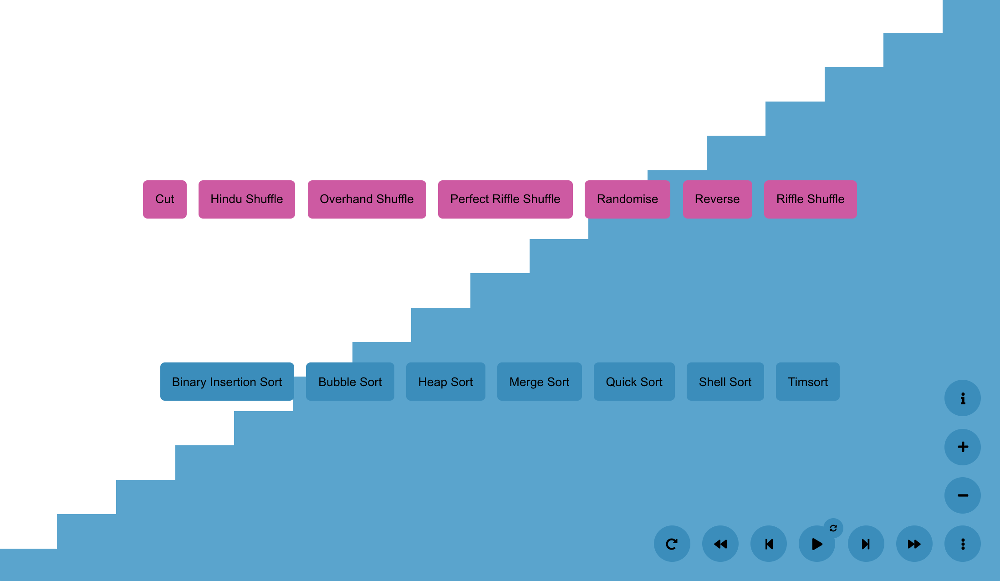

# Sorting Visualiser

A simple visualisation tool for some well known sorting algorithms.

## Usage

When you load the page you will be presented with sorted data.

Pressing play here will perform the currently selected sort (heapsort by
default) on the already sorted data.

The data can be modified/unsorted by using the unsorting algorithms (in pink)
made visible by opening the extended menu (the button marked <kbd>⋮</kbd>).

The current sorting algorithm can also be set in this menu by pressing the blue
buttons.

Try to modify the data in such a way that you get an idea for the algorithm. For
example, running timsort on reverse sorted data is very fast, but quicksort is
very slow!

  
### Keyboard Shortcuts

There are some keyboard shortcuts for the experienced user:

| Key | Action |
|-|-|
| <kbd>Space</kbd> | Play / Pause |
| <kbd>→</kbd> \**when playing*\* | Increase Animation Speed |
| <kbd>←</kbd> \**when playing*\* | Decrease Animation Speed |
| <kbd>→</kbd> \**when paused*\* | Next Move |
| <kbd>←</kbd> \**when paused*\* | Previous Move |
| <kbd>↑</kbd> | Increase Data Size |
| <kbd>↓</kbd> | Decrease Data Size |
| <kbd>r</kbd> | Reset to initial unsorted state |
| <kbd>`</kbd> | Reverse Animation Direction |
| <kbd>Esc</kbd> | Open / Close Extended Menu |
| <kbd>s</kbd> | Show / Hide Stats for Nerds |
